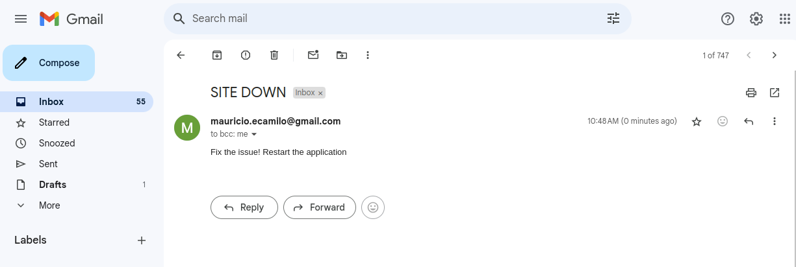

# Demo Project 5

Website Monitoring and Recovery

## Technologies Used

Python, Linode, Docker, Linux

## Project Description

- Create a server on a cloud platform
- Install Docker and run a Docker container on the remote server
- Write a Python script that monitors the website by accessing it and validating the HTTP response
- Write a Python script that sends an email notification when website is down
- Write a Python script that automatically restarts the application & server when the application is down

### Details of project

- send_notification(email_msg)

  ```sh
    def send_notification(email_msg):
        print('Sending email...')
        with smtplib.SMTP('smtp.gmail.com', 587) as smtp:  # Configure to use Gmail's SMTP server
            smtp.starttls()
            smtp.ehlo()  # Establishes a secure connection with the email server
            smtp.login(EMAIL_ADDRESS, EMAIL_PASSWORD)  # Login with credentials
            message = f"Subject: SITE DOWN\n{email_msg}"  # Format the email content
            smtp.sendmail(EMAIL_ADDRESS, EMAIL_ADDRESS, message)  # Send the email to the specified address

  ```
  Sends an email notification using Gmail's SMTP server whenever an issue with the application is detected.

  The function formats the email subject as "SITE DOWN" and includes the message passed in email_msg.
  
  email_msg: The message to be included in the body of the email.

  The function uses Gmail's SMTP server (smtp.gmail.com), authenticates with the provided EMAIL_ADDRESS and EMAIL_PASSWORD (which must be generated as an app password in Gmail), and sends the email.
 
  

- restart_container()

   ```sh
    def restart_container():
        ssh = paramiko.SSHClient()
        ssh.set_missing_host_key_policy(paramiko.AutoAddPolicy())  # Automatically accept the first connection
        ssh.connect(hostname='54.234.185.151', username='root', key_filename='/home/mauricio/.ssh/id_rsa')  # SSH into the server
        stdin, stdout, stderr = ssh.exec_command('docker start b7c59b87cce6')  # Restart the container using its ID
        print(stdout.readlines())  # Print the output of the command
        ssh.close()  # Close the SSH connection
        print('Application Restarted')
  ```

  The function establishes an SSH connection to the server (54.234.185.151) using a private key (id_rsa).

  It executes the command docker start to restart the container.

  After running the command, it prints the output of the command, closes the SSH connection, and prints a message indicating that the application was restarted.

- restart_server_and_container()

   ```sh
    def restart_server_and_container():
        print('Rebooting the server...')
        client = linode_api4.LinodeClient(LINODE_TOKEN)
        nginx_server = client.load(linode_api4.Instance, 52236040)  # Get the Linode instance
        nginx_server.reboot()  # Reboot the server

        while True:  # Wait until the server is back online
            nginx_server = client.load(linode_api4.Instance, 52236040)
            if nginx_server.status == 'running':  # If the server is running
                time.sleep(5)  # Wait for a few seconds before restarting the container
                restart_container()  # Restart the container after server reboot
                break
  ```
  Reboots the Linode server and then restarts the application container.

  First, the server is rebooted using nginx_server.reboot().

  After rebooting, the code waits for the server to become running again. Once the server is online, it waits for 5 seconds and then restarts the application container using the restart_container() function.

- monitor_application()

   ```sh
    def monitor_application():
        try:
            response = requests.get('http://54.234.185.151:8080/')  # Check if the web application is accessible
            if response.status_code == 200:  # If the application is up
                print('Application is running successfully!')
            else:
                print('Application Down. Fix it!')
                msg = f"Application returned {response.status_code}"  # Log the error with status code
                send_notification(msg)  # Send an email notification
                restart_container()  # Restart the container
        except Exception as ex:  # If there is a connection error (e.g., server is down)
            print(f"Connection error happened: {ex}")
            msg = f"Application not accessible at all"  # Notify that the application is down
            send_notification(msg)  # Send an email notification
            restart_server_and_container()  # Reboot the server and restart the container
  ```

  This function monitors the application by making an HTTP request to the web server.

  If there is an exception (e.g., the application is not accessible at all), it will send an email notification and call the restart_server_and_container() function to reboot the server and restart the container.

- Schedule the Monitoring

  ```sh
    schedule.every(5).minutes.do(monitor_application)

    while True:
        schedule.run_pending()  
  ```
  As explained before, it runs every 5 minutes indefinitely.
